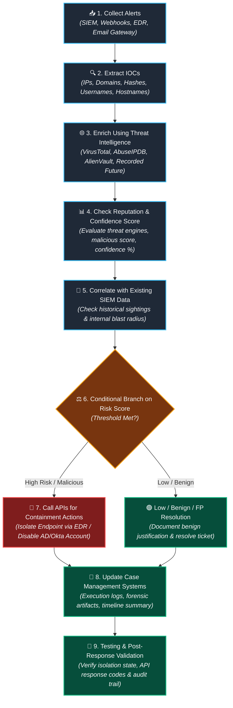

# As it is 

collect alerts -> extract iocs -> enrich them using threat intelligence -> check reputation and confidence score -> corelate it with extiing siem data to check if it is a known ioc ->  create conditional branch on risk score -> and on that basis we call apis to take containment actions to isolate the compromised endpoint or disable the compromised account -> then we update the cases in case management systems with execution logs & artificats summaries -> testing

# 🛡️ General SOAR Playbook Creation Architecture & Flow

> **Standard Operating Procedure & Engineering Blueprint**  
> End-to-end playbook lifecycle: from ingestion and threat intelligence correlation to automated API containment, case management documentation, and rigorous testing.

---

## 🧭 Vertical Workflow Overview

```text
Collect Alerts
      │
      ▼
Extract IOCs
      │
      ▼
Enrich Them Using Threat Intelligence
      │
      ▼
Check Reputation and Confidence Score
      │
      ▼
Correlate with Existing SIEM Data (Check if Known IOC)
      │
      ▼
Create Conditional Branch on Risk Score
      │
      ▼
Call APIs to Take Containment Actions (Isolate Endpoint / Disable Account)
      │
      ▼
Update Cases in Case Management Systems (Execution Logs & Artifact Summaries)
      │
      ▼
Testing & Validation
```

---

## 📊 Visual Box Flowchart

```text
┌────────────────────────────────────────────────────────────────────────┐
│ 1. Collect Alerts                                                      │
│    Ingest events from SIEM, EDR, Email Gateways, or Webhooks           │
└───────────────────────────────────┬────────────────────────────────────┘
                                    │
                                    ▼
┌────────────────────────────────────────────────────────────────────────┐
│ 2. Extract IOCs                                                        │
│    Parse IPs, Domains, URLs, File Hashes, Hostnames & Usernames        │
└───────────────────────────────────┬────────────────────────────────────┘
                                    │
                                    ▼
┌────────────────────────────────────────────────────────────────────────┐
│ 3. Enrich Them Using Threat Intelligence                               │
│    Query external TI feeds (VirusTotal, AbuseIPDB, AlienVault OTX)    │
└───────────────────────────────────┬────────────────────────────────────┘
                                    │
                                    ▼
┌────────────────────────────────────────────────────────────────────────┐
│ 4. Check Reputation and Confidence Score                               │
│    Evaluate malicious verdict, confidence thresholds & sighting ratios │
└───────────────────────────────────┬────────────────────────────────────┘
                                    │
                                    ▼
┌────────────────────────────────────────────────────────────────────────┐
│ 5. Correlate with Existing SIEM Data                                   │
│    Query historical logs to check if IOC is known & map blast radius   │
└───────────────────────────────────┬────────────────────────────────────┘
                                    │
                                    ▼
┌────────────────────────────────────────────────────────────────────────┐
│ 6. Create Conditional Branch on Risk Score                             │
│    Evaluate calculated risk vs pre-defined policy thresholds           │
└───────────────────────────────────┬────────────────────────────────────┘
                                    │
            ┌───────────────────────┴────────────────────────┐
            │ [ High Risk Score ]                            │ [ Low / Benign ]
            ▼                                                ▼
┌────────────────────────────────────────┐       ┌───────────────────────┐
│ 7. Call APIs for Containment Actions   │       │ Close / Log & Monitor │
│    - Isolate Compromised Endpoint      │       │ (Auto-close FP / Benign│
│    - Disable Compromised Account       │       │ with audit rationale) │
└───────────────────┬────────────────────┘       └───────────┬───────────┘
                    │                                        │
                    └───────────────────┬────────────────────┘
                                        │
                                        ▼
┌────────────────────────────────────────────────────────────────────────┐
│ 8. Update Cases in Case Management Systems                             │
│    Push execution logs, war room notes, forensic evidence & artifacts  │
└───────────────────────────────────┬────────────────────────────────────┘
                                    │
                                    ▼
┌────────────────────────────────────────────────────────────────────────┐
│ 9. Testing & Post-Response Validation                                  │
│    Verify containment state, run health checks & validate resolution   │
└────────────────────────────────────────────────────────────────────────┘
```

---

## 🔄 Interactive Visual Diagram (Mermaid)



---

## 📋 Step-by-Step Technical Breakdown

| Step | Phase | Technical Mechanics & Tools | Expected Outputs & Artifacts |
| :--- | :--- | :--- | :--- |
| **1** | **Collect Alerts** | Ingestion via SIEM API/Webhook (Splunk, Microsoft Sentinel, QRadar), EDR alerts (CrowdStrike, Defender for Endpoint), or Cloud Security alerts. | Normalized Incident JSON with raw payload, timestamps, alert source, and severity. |
| **2** | **Extract IOCs** | Regex parsing, SOAR indicator extractors, and field mapping for: IPs (`src_ip`, `dest_ip`), Domains/URLs, File Hashes (MD5, SHA256), User Accounts (`user_principal_name`), and Machine Names (`hostname`). | Deduped Indicator List object populated in SOAR context data. |
| **3** | **Enrich via Threat Intel** | Parallel API queries to Threat Intelligence platforms: VirusTotal, AbuseIPDB, Shodan, AlienVault OTX, Mandiant Advantage, Recorded Future. | Threat Intel reports, geo-location, ASN, known threat actor tags, and campaign metadata. |
| **4** | **Check Reputation & Confidence Score** | Evaluate detection metrics: positive engine count (e.g. $\ge 5/70$ on VT), AbuseIPDB confidence $> 80\%$, threat category (C2, Ransomware, Phishing). | Computed Threat Severity rating (`MALICIOUS`, `SUSPICIOUS`, `BENIGN`, `UNKNOWN`). |
| **5** | **Correlate with Existing SIEM Data** | Query SIEM historical index/data lake: *Has this IOC been seen in firewall, proxy, or DNS logs within the last 30/60/90 days? How many internal assets communicated with it?* | Internal Blast Radius report: affected hostnames, timestamps of first/last contact, and traffic volume. |
| **6** | **Conditional Branch on Risk Score** | Evaluation gate applying enterprise risk logic: <br>`IF (Reputation == Malicious AND Sighted_In_SIEM == True) OR Risk_Score >= 80` $\rightarrow$ Containment Branch. <br>`ELSE` $\rightarrow$ Low Risk / False Positive Review Branch. | Automated playbook branch routing direction. |
| **7** | **Call Containment APIs** | Execute REST API actions across response controls: <br>• **EDR API:** Network isolate host (CrowdStrike `contain_host`, Defender `isolate`). <br>• **IAM API:** Active Directory / Okta / Azure AD (`disable-account`, `revoke-user-sessions`, `force-password-reset`). | API HTTP 200/201 response, isolation confirmation ID, containment timestamp. |
| **8** | **Update Case Management** | Push bi-directional updates via API to ServiceNow SecOps, Jira Service Desk, or Cortex XSOAR War Room: attach full execution trace, enriched IOC tables, containment proof, and analyst notes. | Enriched case ticket with audit-ready forensic artifact attachments and SLA timestamps. |
| **9** | **Testing & Validation** | Validate playbook reliability: mock payload unit tests, dry-run simulation, API rate limit & timeout error handling checks, and post-containment verification (confirm endpoint is genuinely offline). | Passed test report, error log validation, and sign-off for production automation. |

---

## 🎯 Interview Quick Pitch (How to Explain This Flow)

> *"When designing or explaining a production SOAR playbook, I structure the workflow around a standard 9-stage engineering pattern:*
> 
> 1. *First, we **collect alerts** from sources like SIEM, EDR, or Email Gateways.*
> 2. *We **extract all relevant IOCs**—such as IPs, hashes, domains, and user accounts.*
> 3. *We **enrich them using threat intelligence** feeds like VirusTotal, AbuseIPDB, and AlienVault OTX.*
> 4. *We **evaluate the reputation and confidence score** against our detection thresholds.*
> 5. *We **correlate the IOCs with our existing SIEM data** to check if it's an existing known IOC and quantify internal blast radius.*
> 6. *We implement a **conditional decision branch based on the composite risk score**.*
> 7. *If high-risk, we automatically **call APIs to execute containment actions**—such as isolating the compromised endpoint via EDR or disabling the compromised user account in Active Directory.*
> 8. *We then **update the case management system** (ServiceNow, Jira, or XSOAR War Room) with complete execution logs, artifact summaries, and forensic timelines.*
> 9. *Finally, during development and deployment, we run **rigorous testing and dry-run validation** to ensure resilience, error handling, and zero unintended business disruption."*
